<div align="center">
    
    <a href="https://www.jayzhu.one/"></a>
    
    
    
</div>


<div align="center">

  <!-- dynamic typing effect 动态打字效果 -->
  <div align="center">
    
  </div>

<!-- knock code pictures 敲代码的图片 -->
    

<br>

<!-- GitHub Activity Graph GitHub 活动图 -->
<table align="center">
  <tr>
    <td>
        <!-- Snake Code Contribution Map 贪吃蛇代码贡献图 -->
        <picture>
          <source media="(prefers-color-scheme: dark)" srcset="https://cdn.jsdelivr.net/gh/Jayzhuoct/Jayzhuoct/profile-snake-contrib/github-contribution-grid-snake-dark.svg" />
          <source media="(prefers-color-scheme: light)" srcset="https://cdn.jsdelivr.net/gh/Jayzhuoct/Jayzhuoct/profile-snake-contrib/github-contribution-grid-snake.svg" />
          
        </picture>
    </td>
    <td>
        
    </td>
  </tr>
</table>


</div>

#  🙋 Hello

### 🤺 About Me
<table>
    <tr>
        <td>
            <a href="https://git.io/typing-svg">
                
            </a>
        </td>
        <!-- Github-Stats-Terminal 终端风格信息 -->
        <td>
            <div align="center">
                
            </div>
        </td>
    </tr>
</table>

<!-- ########################################## 分割 ########################################## -->


<div align="center" >
    <!-- GitHub 奖杯🏆 -->
    <br>
    <!-- GitHub 数据统计 -->
    
    
</div>

<!-- ########################################## 分割 ########################################## -->


# 💪 Skills

### 👏 already


### ✍️ plan


### 🧰 tool
<a href="https://t.me/Limerence_oct/"></a>


<!-- programming tool icon 编程工具图标 -->


<!-- ########################################## 分割 ########################################## -->


# 📊WakaTime
<table>
    <tr>
        <td>
            <!-- wakatime 统计 -->
        
        </td>
        <td>
            <div align="center">
            
            </div>
        </td>
    </tr>
    <tr>
        <!-- Wakatime Graph-->
        <td>
            <div align="center">
            
            </div>
        </td>
        <td>
            
        </td>
    </tr>
    <tr>
        <td>
            
        </td>
        <td>
            <div align="center">
            
            </div>
        </td>
    </tr>
</table>

<!--START_SECTION:waka-->
**I'm a Night 🦉** 

```text
🌞 Morning                38 commits          ⬛⬛⬜⬜⬜⬜⬜⬜⬜⬜⬜⬜⬜⬜⬜⬜⬜⬜⬜⬜⬜⬜⬜⬜⬜   09.03 % 
🌆 Daytime                85 commits          ⬛⬛⬛⬛⬛⬜⬜⬜⬜⬜⬜⬜⬜⬜⬜⬜⬜⬜⬜⬜⬜⬜⬜⬜⬜   20.19 % 
🌃 Evening                294 commits         ⬛⬛⬛⬛⬛⬛⬛⬛⬛⬛⬛⬛⬛⬛⬛⬛⬛⬜⬜⬜⬜⬜⬜⬜⬜   69.83 % 
🌙 Night                  4 commits           ⬜⬜⬜⬜⬜⬜⬜⬜⬜⬜⬜⬜⬜⬜⬜⬜⬜⬜⬜⬜⬜⬜⬜⬜⬜   00.95 % 
```
📅 **I'm Most Productive on Saturday** 

```text
Monday                   66 commits          ⬛⬛⬛⬛⬜⬜⬜⬜⬜⬜⬜⬜⬜⬜⬜⬜⬜⬜⬜⬜⬜⬜⬜⬜⬜   15.68 % 
Tuesday                  53 commits          ⬛⬛⬛⬜⬜⬜⬜⬜⬜⬜⬜⬜⬜⬜⬜⬜⬜⬜⬜⬜⬜⬜⬜⬜⬜   12.59 % 
Wednesday                56 commits          ⬛⬛⬛⬜⬜⬜⬜⬜⬜⬜⬜⬜⬜⬜⬜⬜⬜⬜⬜⬜⬜⬜⬜⬜⬜   13.30 % 
Thursday                 46 commits          ⬛⬛⬛⬜⬜⬜⬜⬜⬜⬜⬜⬜⬜⬜⬜⬜⬜⬜⬜⬜⬜⬜⬜⬜⬜   10.93 % 
Friday                   61 commits          ⬛⬛⬛⬛⬜⬜⬜⬜⬜⬜⬜⬜⬜⬜⬜⬜⬜⬜⬜⬜⬜⬜⬜⬜⬜   14.49 % 
Saturday                 71 commits          ⬛⬛⬛⬛⬜⬜⬜⬜⬜⬜⬜⬜⬜⬜⬜⬜⬜⬜⬜⬜⬜⬜⬜⬜⬜   16.86 % 
Sunday                   68 commits          ⬛⬛⬛⬛⬜⬜⬜⬜⬜⬜⬜⬜⬜⬜⬜⬜⬜⬜⬜⬜⬜⬜⬜⬜⬜   16.15 % 
```


📊 **This Week I Spent My Time On** 

```text
🕑︎ Time Zone: Asia/Shanghai

💬 Programming Languages: 
Java                     2 hrs 35 mins       ⬛⬛⬛⬛⬛⬛⬛⬛⬛⬛⬛⬛⬛⬛⬛⬛⬛⬛⬛⬛⬛⬛⬛⬛⬜   96.52 % 
Markdown                 5 mins              ⬛⬜⬜⬜⬜⬜⬜⬜⬜⬜⬜⬜⬜⬜⬜⬜⬜⬜⬜⬜⬜⬜⬜⬜⬜   03.48 % 

🔥 Editors: 
IntelliJ                 2 hrs 40 mins       ⬛⬛⬛⬛⬛⬛⬛⬛⬛⬛⬛⬛⬛⬛⬛⬛⬛⬛⬛⬛⬛⬛⬛⬛⬛   100.00 % 

💻 Operating System: 
Mac                      2 hrs 40 mins       ⬛⬛⬛⬛⬛⬛⬛⬛⬛⬛⬛⬛⬛⬛⬛⬛⬛⬛⬛⬛⬛⬛⬛⬛⬛   100.00 % 
```


 Last Updated on 08/10/2023 20:06:13 UTC
<!--END_SECTION:waka-->


<!-- ########################################## 分割 ########################################## -->


# 📖 knowledge map

```mermaid
mindmap
  root((技术栈))
    Java基础
      基本语法
      面向对象
      集合技术&I/O技术
      网络编程&多线程技术
      JDK新特性&基础加强
      XML配置解析技术
    JavaWeb
      数据库
        MySQL
        MariaDB
      网页开发技术
        HTML5
      样式表技术
        CSS3
      网页脚本技术
        JavaScript
      服务容器&协议
        Tomcat
        HTTP
      动态网页技术
        JSP
        EL&JSTL
      异步交互技术
        AJAX
        Axios
      前端开发框架
        Vue
        React
    开发框架
      服务开发框架
        Spring
      Web开发框架
        SpringMVC
      持久层开发框架
        MyBatis
        JPA
      安全框架
        SpringSecurity
        Shiro
      服务快速开发技术
        SpringBoot
      Web服务器
        Nginx
        Apache
      版本控制
        Git
      项目构建
        Maven
        Gradle
      服务器系统
        Linux
    微服务&分布式
      微服务配置中心
        Nacos
      微服务注册中心
        Eureka
        Nacos
      微服务调用
        OpenFeign
      微服务网关
        Zuul
        Gateway
      微服务保护
        Sentinel
      微服务部署
        Docker
        Kubernetes
      负载均衡
        Nginx
        Ribbon
      消息队列
        RabbitMQ
        ActiveMQ
        RocketMQ
      分布式缓存
        Redis
      分布式搜索
        Elasticsearch
      分布式事务
        Seata
      分布式协调服务
        Zookeeper
```

<div align="center" >



<!-- man 图片 -->


</div>

<!-- ########################################## 分割 ########################################## -->


<div align="center">
<!-- run 图片 -->

<table class="no-border">
    <tr>
        <td>
            <!-- Joke 笑话 -->
            
        </td>
        <td>
            <!-- Quotes 名人名言 -->
            
        </td>
    </tr>
</table>

<!-- github-readme-streak-stats 连续提交代码天数记录 -->
<table>
    <tr>
        <td>
            
        </td>
        <td>
           
        </td>
        <td>
            
        </td>
    </tr>
</table>
</div>

<!-- ########################################## 分割 ########################################## -->


# 🧑🏻‍💻 GitHub
<!-- GitHub metrics 信息指标 -->
<div align="center">

<!-- metrics 基础资料 -->


<!-- 表格 -->
<table>
  <tr>
    <td></td>
    <td></td>
  </tr>
  <tr>
    <td></td>
    <td></td>
  </tr>
  <tr>
    <td></td>
    <td></td>
  </tr>
  <tr>
    <td></td>
    <td></td>
  </tr>
  <tr>
    <td></td>
    <td></td>
  </tr>
</table>

<!-- profile-3d-contrib 3D贡献图-->


<!-- skyline 图片 -->

<!-- icon 图片 -->


<!-- rocket 图片 -->


</div>


