  <!-- dynamic typing effect 动态打字效果 -->
  

    
  

<!-- knock code pictures 敲代码的图片 -->
    

 

<!-- GitHub Activity Graph GitHub 活动图 -->
<table align="center">
  <tr>
    <td>
        <!-- Snake Code Contribution Map 贪吃蛇代码贡献图 -->
        <picture>
          <source media="(prefers-color-scheme: dark)" srcset="https://cdn.jsdelivr.net/gh/Jayzhuoct/Jayzhuoct/profile-snake-contrib/github-contribution-grid-snake-dark.svg" />
          <source media="(prefers-color-scheme: light)" srcset="https://cdn.jsdelivr.net/gh/Jayzhuoct/Jayzhuoct/profile-snake-contrib/github-contribution-grid-snake.svg" />
          
        </picture>
    </td>
    <td>
        
    </td>
  </tr>
</table>

#  🙋 Hello

### 🤺 About Me
<table>
    <tr>
        <td>
            
        </td>
        <!-- Github-Stats-Terminal 终端风格信息 -->
        <td>
            

                
            

        </td>
    </tr>
</table>

<!-- ########################################## 分割 ########################################## -->

    <!-- GitHub 奖杯🏆 -->
     
    <!-- GitHub 数据统计 -->
    
    

<!-- ########################################## 分割 ########################################## -->

# 💪 Skills

### 👏 already

### ✍️ plan

### 🧰 tool

<!-- programming tool icon 编程工具图标 -->

<!-- svg -->

 

 

<!-- gif -->

<!-- ########################################## 分割 ########################################## -->

# 📊WakaTime
<table>
    <tr>
        <td>
            <!-- wakatime 统计 -->
        
        </td>
        <td>
            

            
            

        </td>
    </tr>
    <tr>
        <!-- Wakatime Graph-->
        <td>
            

            
            

        </td>
        <td>
            
        </td>
    </tr>
    <tr>
        <td>
            
        </td>
        <td>
            

            
            

        </td>
    </tr>
</table>

<!--START_SECTION:waka-->
<!--END_SECTION:waka-->

<!-- ########################################## 分割 ########################################## -->

# 📖 knowledge map

```mermaid
mindmap
  root((小朱同学))
    编程
      Java开发
      网络爬虫
      人工智能
    摄影
      人文
      建筑
      风景
    旅行
      苏州
      南京
      滁州
      合肥
      寿县
    阅读
      人物传记
      个人成长
      社会文化
      心理
      计算机技术
```

<!-- man 图片 -->

<!-- ########################################## 分割 ########################################## -->

<!-- run 图片 -->

<table class="no-border">
    <tr>
        <td>
            <!-- Joke 笑话 -->
            
        </td>
        <td>
            <!-- Quotes 名人名言 -->
            
        </td>
    </tr>
</table>

<!-- github-readme-streak-stats 连续提交代码天数记录 -->
<table>
    <tr>
        <td>
            
        </td>
        <td>
           
        </td>
        <td>
            
        </td>
    </tr>
</table>

<!-- ########################################## 分割 ########################################## -->

# 🧑🏻‍💻 GitHub
<!-- GitHub metrics 信息指标 -->

<!-- metrics 基础资料 -->

<!-- 表格 -->
<table>
  <tr>
    <td></td>
    <td></td>
  </tr>
  <tr>
    <td></td>
    <td></td>
  </tr>
  <tr>
    <td></td>
    <td></td>
  </tr>
  <tr>
    <td></td>
    <td></td>
  </tr>
  <tr>
    <td></td>
    <td></td>
  </tr>
</table>

<!-- profile-3d-contrib 3D贡献图-->

<!-- skyline 图片 -->

<!-- icon 图片 -->

<!-- rocket 图片 -->

